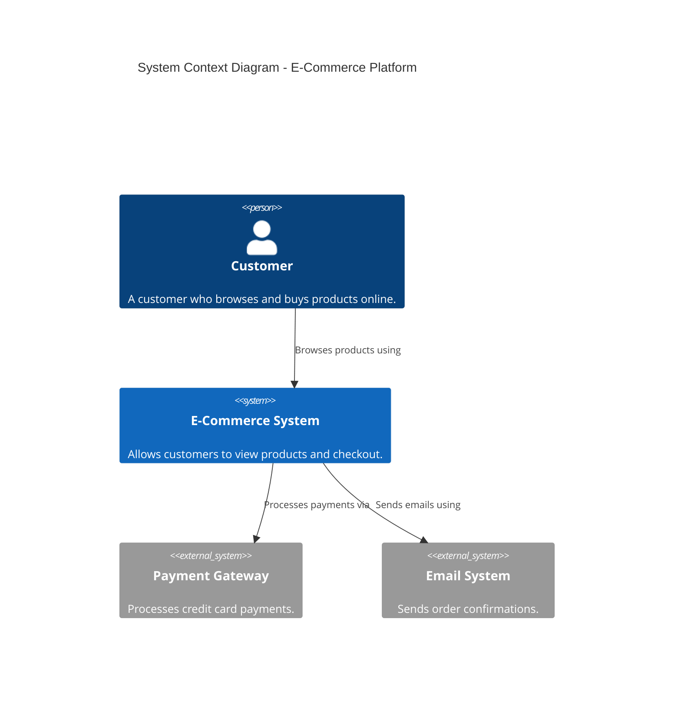
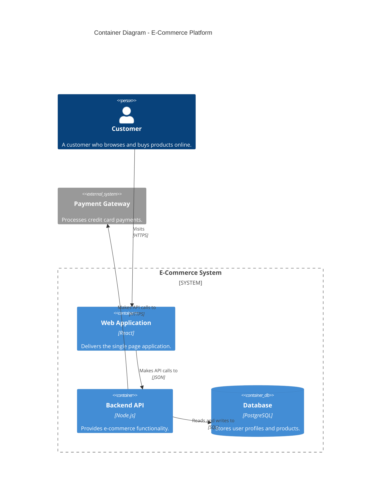
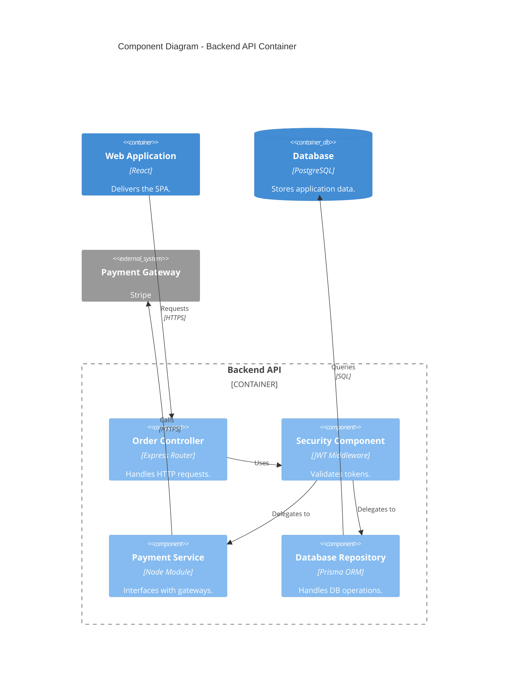

# 🗺️ Mastering the C4 Model for Software Architecture

Welcome to my repository! This project serves as a consolidation of my understanding and learning regarding the **C4 model**, an "easy to learn, developer-friendly approach to software architecture diagramming" created by Simon Brown.

Information and concepts here are adapted from the official [C4 Model website](https://c4model.com/).

---

## 📖 What is the C4 Model?

The C4 model is a standardized, hierarchical framework for visualizing software architecture. It solves the common problem of confusing, inconsistent, and overly complex architecture diagrams. 

At its core, the C4 model provides:
1. **A set of hierarchical abstractions:** Software systems, containers, components, and code.
2. **A set of hierarchical diagrams:** System context, containers, components, and code.
3. **An additional set of supporting diagrams:** System landscape, dynamic, and deployment.
4. **Tool and notation independence:** You can draw C4 diagrams using whiteboards, simple boxes and lines, or diagrams-as-code tools.

Think of it as **Google Maps for your code**. It allows you to zoom in and out of an architecture from a high-level overview down to the specific implementation details.

---

## 🧱 Core Abstractions

To create maps of your code, we first need a common set of abstractions:
* **🧍 Person:** The end-users or actors interacting with the system.
* **🏢 Software System:** The highest level of abstraction. A system is made up of multiple containers.
* **📦 Container:** A separately deployable or runnable unit (e.g., a web application, database, microservice, mobile app).
* **⚙️ Component:** A grouping of related functionality encapsulated behind a well-defined interface, running inside a container.

---

## 🔍 The 4 Levels of Diagrams

Here is a breakdown of the four core diagram types, illustrated using Mermaid's C4 diagram support for a theoretical **E-Commerce Platform**.

### Level 1: System Context Diagram
The System Context diagram provides a starting point, showing how the software system in scope fits into the world around it. 

**Target Audience:** Non-technical stakeholders, business analysts, and developers.

### Level 2: Container Diagram
Zooming into the System Context, the Container diagram shows the high-level shape of the software architecture and how responsibilities are distributed.

**Target Audience:** Software developers, support staff, and IT operations.

### Level 3: Component Diagram
Zooming into an individual Container reveals the Component diagram. It shows the internal components of a container and how they interact.

**Target Audience:** Software developers and software architects.

### Level 4: Code Diagram
The deepest zoom level. It shows how an individual component is implemented under the hood (e.g., UML Class Diagrams).

> ⚠️ Note from the creator: This level is considered optional and is usually ignored because modern codebases change too fast. Code-level documentation is best generated automatically directly from the source code via IDE tooling.

---

## 🛠️ Additional Supporting Diagrams
The official C4 model also specifies three supplementary diagrams for when the static structural models aren't enough:
1. System Landscape Diagram: Shows the "big picture" of the IT landscape across multiple systems within an enterprise.
2. Dynamic Diagram: Used to show how elements interact at runtime to implement a specific use case or user story (similar to a UML Sequence Diagram).
3. Deployment Diagram: Shows how containers in the static model are mapped to the physical infrastructure (e.g., AWS, Azure, on-premise servers).

---

## 🔗 References & Resources
- [The Official C4 Model Website](https://c4model.com/)
- [Mermaid C4 Syntax Documentation](https://mermaid.js.org/syntax/c4.html)
- [Structurizr](https://structurizr.com/) (Diagramming tool built specifically for the C4 model by Simon Brown)
